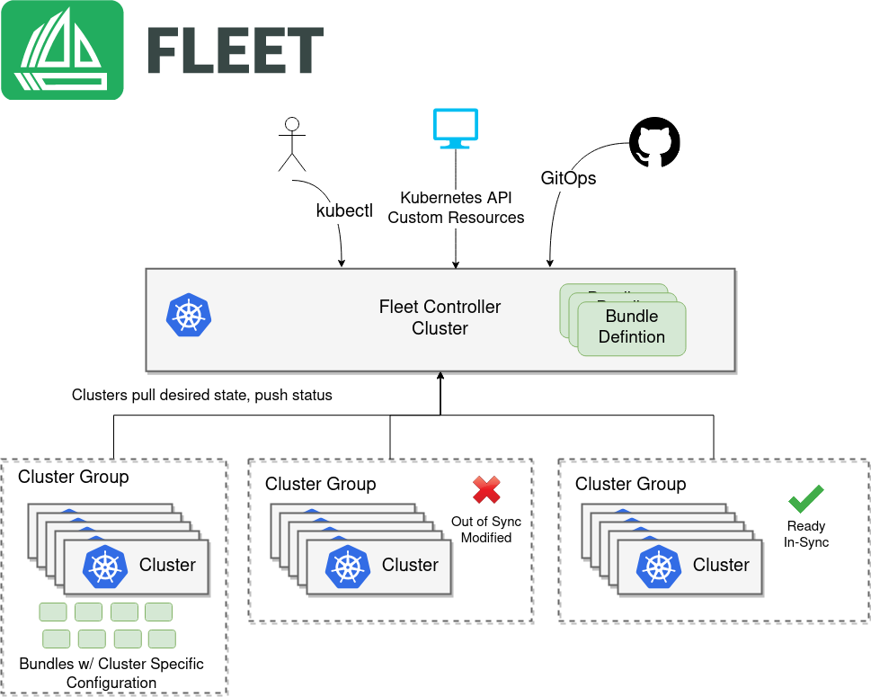

# Introduction
[](https://app.fossa.com/projects/git%2Bgithub.com%2Francher%2Ffleet?ref=badge_shield)


[](https://github.com/rancher/fleet/actions/workflows/ci.yml)
[](https://github.com/rancher/fleet/actions/workflows/e2e-ci.yml)
[](https://github.com/rancher/fleet/actions/workflows/e2e-multicluster-ci.yml)
[](https://github.com/rancher/fleet/actions/workflows/golangci-lint.yml)



Fleet is GitOps at scale. Fleet is designed to manage multiple clusters. It's also lightweight
enough that it works great for a single cluster too, but it really shines
when you get to a large scale. By large scale we mean either a lot of clusters, a lot of deployments, or a lot of
teams in a single organization.

Fleet can manage deployments from git of raw Kubernetes YAML, Helm charts, or Kustomize or any combination of the three.
Regardless of the source all resources are dynamically turned into Helm charts and Helm is used as the engine to
deploy everything in the cluster. This gives a high degree of control, consistency, and auditability. Fleet focuses not only on
the ability to scale, but to give one a high degree of control and visibility to exactly what is installed on the cluster.

# Quick Start

For more information, have a look at Fleet's [documentation](https://fleet.rancher.io/).

## Install

Get `helm` if you don't have it.  Helm 3 is just a CLI and won't do bad insecure
things to your cluster.

For instance, using Homebrew:
```
brew install helm
```

Install the Fleet Helm charts (there's two because we separate out CRDs for ultimate flexibility.)

```shell
helm -n cattle-fleet-system install --create-namespace --wait \
    fleet-crd https://github.com/rancher/fleet/releases/download/v0.13.2/fleet-crd-0.13.2.tgz
helm -n cattle-fleet-system install --create-namespace --wait \
    fleet https://github.com/rancher/fleet/releases/download/v0.13.3/fleet-0.13.3.tgz
```

## Add a Git Repo to watch

Change `spec.repo` to your git repo of choice.  Kubernetes manifest files that should
be deployed should be in `/manifests` in your repo.

```bash
cat > example.yaml << "EOF"
apiVersion: fleet.cattle.io/v1alpha1
kind: GitRepo
metadata:
  name: sample
  # This namespace is special and auto-wired to deploy to the local cluster
  namespace: fleet-local
spec:
  # Everything from this repo will be run in this cluster. You trust me right?
  repo: "https://github.com/rancher/fleet-examples"
  paths:
  - simple
EOF

kubectl apply -f example.yaml
```

## Get Status

Get status of what Fleet is doing:

```shell
kubectl -n fleet-local get fleet
```

You should see something like this get created in your cluster.

```
kubectl get deploy frontend
```
```
NAME       READY   UP-TO-DATE   AVAILABLE   AGE
frontend   3/3     3            3           116m
```

Enjoy and read the [docs](https://fleet.rancher.io/).

## License
[](https://app.fossa.com/projects/git%2Bgithub.com%2Francher%2Ffleet?ref=badge_large)

For developer and maintainer documentation, see [DEVELOPING.md](./DEVELOPING.md).

