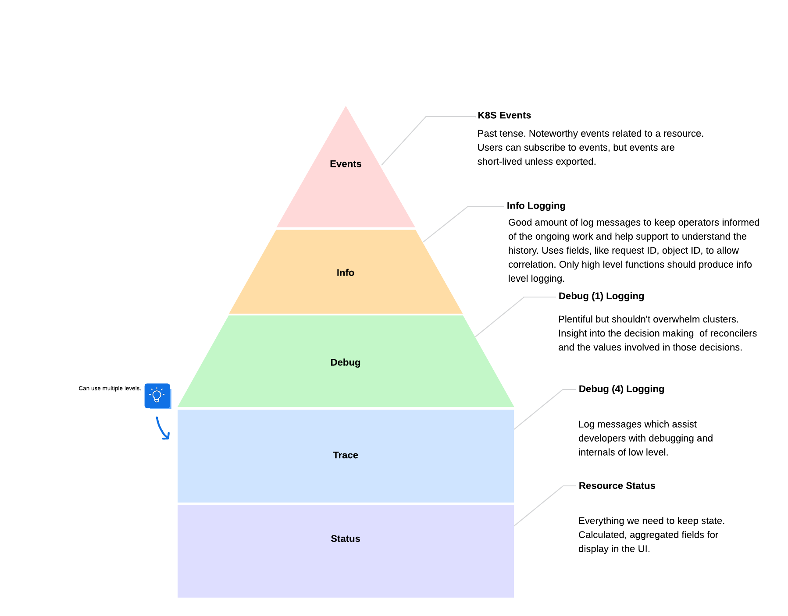

# Structured Logging

Since 0.10, Fleet uses [controller-runtime](https://github.com/kubernetes-sigs/controller-runtime) as its Kubernetes
controller framework. It implements _structured logging_, which basically means logging _constant_ log messages with
variable key-value pairs.

For instance:
```
// Unstructured
myloglib.Log(fmt.Sprintf("Something happened: %v", err))


// Structured
logger.V(1).Info(
    "Reconciling bundle, checking targets, calculating changes, building objects",
    "generation",
    bundle.Generation,
    "observedGeneration",
    bundle.Status.ObservedGeneration,
)
```

More info [here](https://github.com/kubernetes-sigs/controller-runtime/blob/main/TMP-LOGGING.md) on how
`controller-runtime` approaches logging.

Fleet has preexisting logging code using [logrus](https://github.com/sirupsen/logrus), which can be ported to
[zap](https://pkg.go.dev/go.uber.org/zap), for which `controller-runtime` provides helpers.

## Where to log

Logs should be produced from:

* high-level functions, which do something that the user should know about, such as reconciliation, an entity not being
found where it was expected, etc. Implementation details, which live in helper functions (eg. resetting a SHA256 sum for
a manifest), are less relevant for logging.

* functions taking a context as a parameter: these functions can time out, and knowing where the timeout happened before
  the error bubbles up can help troubleshoot it.

## What (not) to log

At the risk of stating the obvious, no sensitive information should be logged (eg. secrets).

## Levels

Fleet logging makes use of the following levels:
* `Info` for events about which users may care, `Info` logs have a verbosity. The default verbosity is 0.
* `Error` for errors

### Verbosity

Log messages can have a numerical verbosity. The default verbosity is 0, we also use 1 for debug logs and 4 for logs
that aid in tracing problems.
If log messages should not be included in the output of a binary started with the `--debug` argument, their level should
be higher than 5.

## Formatting Fields

Fields used for structured logging must follow camelCase. The name of the logger should use kebab-case.

For example:

```
logger := log.FromContext(ctx).WithName("delete-by-release").WithValues("releaseName", releaseName, "keepResources", keepResources)
```

# Consistency is key

Check how code living in the same file, or package, or higher up the call stack, does logging. Ensure that constant
log messages and field names are phrased and formatted in consistent ways.

# Useful links

* [Dave Cheney on
logging](https://web.archive.org/web/20240521184322/https://dave.cheney.net/2015/11/05/lets-talk-about-logging)
