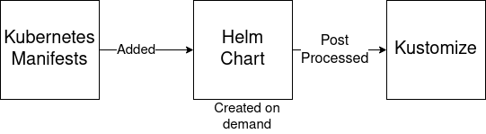

Understanding Bundles
=====================

Bundles are a collection of resources that include additional deployment specific information and can be deployed
to multiple clusters. Each bundle is one [custom resource](../pkg/apis/fleet.cattle.io/v1alpha1/bundle.go) that fully
encapsulates all this information.  Because the type can grow quite large and has various rules and customizations in
it, the `flt` CLI helps improve the user experience of managing this resources.  Instead of managing one large YAML file
that has nested YAML files in it, `flt` allows you to represent your bundle on disk as a series of individual files and
then running `flt apply` will construct the bundle resource and deploy it to the Fleet manager. Bundles go through a
powerful process of how they are rendered into Kubernetes resources.  This process allows one to choose a Kubernetes YAML,
Helm or Kustomize based approach.  All three of these approaches can be combined too. Combining helm with kustomize
often ends up being a great way to manage third party applications. Using plain Kubernetes YAML is typically a more
lightweight approach to manage internal applications.

## Bundle Layout

```
./bundle.yaml               # Bundle descriptor
./manifests/                # Directory for raw kubernetes YAML
./chart/                    # Directory for an inline Helm Chart
./kustomize/                # Directory for kustomization resources
./overlays/${OVERLAY_NAME}  # Directory for kustomization resources
```

This layout is used for on disk for the `flt` command to read and is also the expected structure of embedded resources
in the bundle custom resource.

## Bundle Strategies

One can choose between using plain Kubernetes YAML, Helm, Kustomize, or some combination of the three.  In depth
documentation on each approach can be found at the below links.  Regardless of the strategy you use, you should
 understand all three approaches to understand the capabilities of the system. Refer to [examples](examples.md) for
 specific examples.

## bundle.yaml

The `bundle.yaml` on disk is the same format as the bundle `spec` field and just removes some
annoying boilerplate.  Below is a quick reference of every field with inline comments to how they
are used.

```yaml
# Used to populate metadata.name in the Bundle custom resource
name: mybundle

# Used to populate metadata.labels in the Bundle custom resource. Currently there is no specific use of labels
# by Fleet and is here just to allow the users to add additional metadata to bundles.
labels:
  custom: value

# Used to populate metadata.annotations in the Bundle custom resource. Currently there is no specific use of annotations
# by Fleet and is here just to allow the users to add additional metadata to bundles.
annotations:
  custom: value

# Use a custom folder for plain Kubernetes YAML files.  This can also refer to a URL to download
# resource from.  This uses Hashicorp's go-getter, so any support source (http, git, S3) should work.
# Default: manifests
manifestsDir: ./manifests

# Use a custom folder for kustomize resources. This can also refer to a URL to download resource from, similar to
# the manifestDir field
# Default: kustomize
kustomizeDir: ./kustomize

# Use a custom source for chart resources. This is commonly a URL pointing to the chart tgz file. Similar to the
# the manifestDir field any go-getter URL is supported.
# Default: chart
chart: ./chart

# The default namespace to be applied to resources.  This field is not used to enforce or lock down the deployment
# a specific namespace.  It is only used as a default when a namespaced resource does not specify a namespace.
# Default: default
defaultNamespace: default

# When resources are applied the system will wait for the resources to initially become Ready. If the resources are
# not ready in this timeframe the application of resources fails and the bundle will stay in a NotApplied state.
# Default: 600 (10 minutes)
timeoutSeconds: 600

# Default values to be based to Helm upon installation.
# Default: null
values:
    image: custom/value:latest

# A paused bundle will not update downstream clusters but instead mark the bundle as OutOfSync
# Default: false
paused: false

rolloutStrategy:
    # A number or percentage of clusters that can be unavailable during an update of a bundle. This follows the same
    # basic approach as a deployment rollout strategy
    maxUnavailable: 15%

# Base resources for this bundle. All targets will inherit this content.  The content is typically not manually
# managed but instead populated by the flt CLI.  The name fields should be paths relative to the bundle root.  For
# example, name: chart/Chart.yaml should be used if you are embedding a chart.  If it does not have the chart/ prefix
# it will not be recognized as a chart. The flt CLI will read the directories specified by manifestsDir, kustomizeDir,
# and chart, strip the custom prefix, and normalize the paths to manifests/, kustomize/, chart/ respectively. The
# paths of resources must match the bundle layout specified above.
resources:
# The name of this resource. If you do not put a resources it will get an auto generated name of the format
# manifests/file000
- name: chart/chart.yaml
  # the encoding of the value field.  If this value is blank it is assumed to be valid UTF-8 content. Other supported
  # values are:
  #   base64 - base64'd content
  #   base64+gz - gzip and then base64'd content
  # default:
  encoding:
  # The content of this resource following the encoding set above
  content: |
    name: chartname
    version: v0.1

# Overlays contain customization to resources and options that can be references by targets to compose a specific
# configuration for a target
overlays:
# The name of the overlay. This field is referenced by the targets.
- name: custom1
  # Overlays can reference other overlays. The referenced overlays will be applied before this overlay.
  overlays:
  - custom2
  - custom3
  # Override defaultNamespace
  defaultNamespace: newvalue
  # Override the base dir where the kustomization.yaml is found
  kustomizedDir: production/
  # Override the timeoutSeconds parameter
  timeoutSeconds: 5
  # Merge in new values used by Helm. The merge logic follows the logic of how Helm merges values, which is basically
  # just a map merge and list are overwritten.
  values:
    custom: value
  # Resources to overwrite or patch.  The flt command will populate these resources with the contents of ./overlays/${NAME}
  # The names here are relative to the ./overlays/${NAME} root, not the bundle root.  The names here should match the
  # name specified in the base of the bundle.
  resources:
  - name: manifests/deployment.yaml
    content: |
      kind: Deployment
      ....

# Targets are used to match clusters that should be deployed to.  Each target can specify a series of overlays to apply
# customizations for that cluster.  Targets are evaluated in order and the first one to match is used
targets:
# The name of target. If not specified a default name of the format "target000" will be used
- name: prod
  # Override defaultNamespace
  defaultNamespace: newvalue
  # Override the base dir where the kustomization.yaml is found
  kustomizedDir: production/
  # Override the timeoutSeconds parameter
  timeoutSeconds: 5
  # Merge in new values used by Helm. The merge logic follows the logic of how Helm merges values, which is basically
  # just a map merge and list are overwritten.
  values:
    custom: value
  # Overlays to be applied on this target in the specified order.
  overlays:
  - custom2
  - custom3
  # A selector used to match clusters.  The structure is the standard metav1.LabelSelector format.
  # If clusterGroupSelector or clusterGroup is specified, clusterSelector will be used only to further refine the
  # selection after clusterGroupSelector and clusterGroup is evaluated.
  clusterSelector:
    matchLabels:
      env: prod
  # A selector used to match cluster groups.
  clusterGroupSelector:
    matchLabels:
      region: us-east
  # A specific clusterGroup by name that will be selected
  clusterGroup: group1
```

## Target Matching

All clusters in all cluster groups in the same namespace as the bundles will be evaluated against all bundle targets.
The targets list is evaluated one by one and the first target that matches is used for that bundle for that cluster. If
no match is made, the bundle will not be deployed to the cluster.  There are three approaches to matching clusters.
One can use cluster selectors, cluster group selectors, or an explicit cluster group name.  All criteria is additive so
the final match is evaluated as "clusterSelector && clusterGroupSelector && clusterGroup".  If any of the three have the
default value it is dropped from the criteria.  The default value is either null or "".  It is important to realize
that the value `{}` for a selector means "match everything."

```shell script
# Match everything
clusterSelector: {}
# Selector ignored
clusterSelector: null
```

## Resource Overlays and Patching

A target references a series of overlays and those overlay can have resources in them.  The resource overlay content
using a file based approach.  This is different from kustomize which uses a resource based approach.  In kustomize
the resource Group, Kind, Version, Name, and Namespace identify resources and are then merged or patched.  For Fleet
the overlay resources will override or patch content based on the file name.

```shell script
# Base files
manifests/deployment.yaml
manifests/svc.yaml
# Overlay files
# The follow file we be added
overlays/custom/configmap.yaml
# The following file will replace manifests/svc.yaml
overlays/custom/svc.yaml
# The following file will patch manifest/deployment.yaml
overlays/custom/deployment_patch.yaml
```

A file named `foo` will replace a file called `foo` from the base resources or a previous overlay.  In order to patch
content a file the convention of adding `_patch.` (notice the trailing period) to the filename is used.  The string `_patch.`
will be replaced with `.` from the file name and that will be used as the target.  For example `deployment_patch.yaml`
will target `deployment.yaml`.  The patch will be applied using JSON Merge, Strategic Merge Patch, or JSON Patch.
Which strategy is used is based on the file content. Even though JSON strategies are used, the files can be written
using YAML syntax.

## Render Pipeline



A bundle has three types of resources in it.  Plain kubernetes manifests are available in `manifest/`. Chart files for
a helm chart are available in `chart/`.  Finally, kustomize files are in `kustomize/`.  Each one of these directories
and content types are optional but combined to create one helm chart that is to be deployed to the cluster.  Since
each content type is optional, regardless of the fact that the final asset is a Helm chart, a pure Kubernetes YAML or
kustomize approach is possible.

### Phase 1: Plain Kubernetes YAML 

Any resource that is found in `manifests/` will be copied to the target chart in the `chart/templates/` folder. This
means these files can be plain YAML or have helm golang templating.

### Phase 2: Helm Chart generation

The `chart/` folder is expected to have Helm chart content in it.  If this folder is not found then a chart will
be generated on demand.  This means a `Chart.yaml` will be created for you if not found.  Since content from
`manifests/` is copied to `chart/templates`, one can deploy helm charts without knowning anything about helm, instead
 using an approach closer to `kubectl apply`.
 
 ### Phase 3: Kustomize Post Process
 
 After the Helm chart from phase 2 is rendered, Fleet is called as a post renderer to apply run kustomize.  The
`kustomizeDir` field from the target or overlays can be used to determine which `kustomization.yaml` is invoked.
The objects generated by Helm are put into a field named `${kustomizeDir}/manifests.yaml` and the `kustomization.yaml`
found in `kustomizeDir` is dynamically modified to add `manifests.yaml` to the `resources:` list.
 
